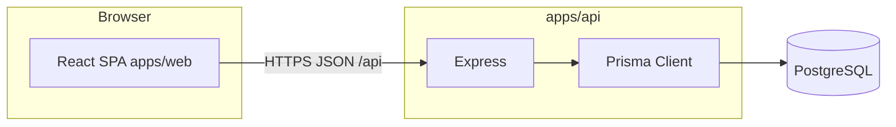

# Minyan-Pays — Programmer Handoff (single source of truth)

*Last updated: 2026-05-03*

This file is the **one document** to share with a developer: product intent, **actual** architecture, data model, API map, design notes, and known gaps. Use it with the repo; where code and docs conflict, **code wins** (especially `apps/api/prisma/schema.prisma` and route files under `apps/api/src/routes/`).

| Topic | Best doc in repo |
|--------|-------------------|
| **Business rules, treasury, first-9, payment reality (Zelle vs APIs)** | [PLAN.md](../PLAN.md) |
| **Product narrative & rewrite-ready UX rules** | [PROGRAM-SUMMARY.md](./PROGRAM-SUMMARY.md) (see note below — some deployment lines are stale) |
| **Local setup & env** | [SETUP.md](../SETUP.md) |
| **Render / production** | [RENDER_DEPLOYMENT.md](./RENDER_DEPLOYMENT.md), [STEP_BY_STEP_DEPLOY.md](./STEP_BY_STEP_DEPLOY.md) |
| **Current sprint / last changes** | [PROJECT_STATUS.md](../PROJECT_STATUS.md) |

---

## 1. What the program is

**Minyan-Pays** is a **mobile-first web app** for synagogue **minyan attendance** and **incentive payouts** (initially for **Dovrey Evrit**). It is **not** a generic payment processor: “pays” means **tracking who is owed**, treasury gating, exports, and manual or batch payouts—not in-app card charges.

Core ideas:

- **Punch-in** (public/kiosk) → record pending arrival → **rabbi confirms or rejects** → confirmed attendance feeds **first-N slots**, weekly bonus logic, and ledgers.
- **Treasury** balance and lock prevent committing payouts without funds.
- **Members** see **only their own** balance, history, and profile; **rabbis** manage today’s session and confirmations; **admins** manage organizations, members, rabbis, locations, settings, treasury funding, reports—**but** check-in confirm/reject is **rabbi-only** (admin endpoints return 403).

Multi-**location** support: each **Organization** is a deployable “site” with its own slug, passwords, members, and treasury.

---

## 2. Repository layout

| Path | Role |
|------|------|
| `apps/web` | React + Vite + Tailwind + i18n (`en`, `he`, `es`, `fr`, `ru`). SPA; `404.html` copied from `index.html` for static hosts (Render). |
| `apps/api` | Express + Prisma + PostgreSQL. JSON REST under `/api/*`. |
| `render.yaml` | Blueprint-style deploy hints for Render. |

Root scripts run API + web together (`npm run dev`).

---

## 3. Architecture (as implemented)

- **Frontend:** React SPA calls API via `VITE_API_BASE_URL` (absolute in production). Dev proxy forwards `/api` to the API port.
- **Backend:** Single Express app; CORS from `WEB_ORIGIN` (comma-separated allowed).
- **Database:** PostgreSQL everywhere; **no SQLite** in current schema (see `schema.prisma` header).
- **Auth:** JWT in `Authorization: Bearer` header; org context via **`X-Organization-Slug`** (and related client state).
- **Security — `apps/api/src/routes/auth.ts`:** **`POST /api/auth/admin`** — if **`Organization.adminPasswordHash`** is set, password must match (bcrypt); otherwise the **bootstrap** secret applies: env **`ADMIN_BOOTSTRAP_PASSWORD`**, else **`ADMIN_PASSWORD`**, else built-in default **`11213Aron`**. Bootstrap logins get JWT **`adminMustChangePassword`**; other **`/api/admin/*`** routes return **403** until **`POST /api/admin/account/password`** sets a real hash. **`POST /api/auth/rabbi`** / **`POST /api/auth/member`** unchanged (rabbi hash or `RABBI_PASSWORD`; member PIN). JWTs **`24h`**; **Cross-tenant:** audit routes vs org.
- **Hosting (typical):** Render — separate **Web Service** (API) + **Static Site** (web `dist`) + **Postgres**. Custom domain e.g. **minyanpays.com**. Details in `docs/RENDER_DEPLOYMENT.md`.

**Legacy / wrong docs:** Root `ARCHITECTURE.md`, `DATABASE_SCHEMA.md`, and `API_SPECIFICATION.md` were placeholder boilerplate; they now redirect here or mirror Prisma/routes (see sections 7–8).

---

## 4. Roles and permissions (summary)

| Capability | Member | Rabbi | Admin |
|------------|--------|-------|-------|
| Punch in/out flows | Yes (approved member where required) | — | — |
| Confirm/reject check-ins | No | Yes | **No** (API 403) |
| Edit today’s session views | Own data | Yes | Read-oriented hub + attendance **time** edits |
| Manage org locations / org CRUD | No | No | Yes |
| Treasury fund/lock | No | Yes | Yes |
| Weekly reports / CSV export | No | Yes | Yes |

**Preferred check-in policy:** `Organization.checkInOnlyPreferred` — when true, only members with `User.preferredForCheckIn` may punch in (enforced in punch flow).

---

## 5. Core workflows

1. **Registration** — `POST /api/register` → creates pending member (`isApproved: false` by default; confirm policy in app).
2. **Punch in** — `POST /api/punch/in` (policy may require preferred list).
3. **Rabbi confirms** — `POST /api/rabbi/attendance/:id/confirm` or reject.
4. **Punch out** — public/member variants (`/api/punch/out-public`, `/api/punch/out`, etc.).
5. **Earnings / ledger** — see `apps/api/src/lib/earnings.ts` and member ledger routes.
6. **Payouts / treasury** — treasury balance + lock; weekly payout records; CSV export — **operational** payouts are often **outside** the app (Zelle has no stable public send API for arbitrary users).

---

## 6. Design and UX

- **Mobile-first**, bottom navigation, distinct tab colors (punch / member / rabbi).
- **Cards**, rounded inputs, gradient primary actions — see live app for reference.
- **Admin hub** (recent): four areas — **Today’s check-ins**, **Member**, **Rabbi**, **Location**; condensed rows; double-click to open; iPhone-friendly stacking.
- **i18n:** JSON locale files under `apps/web` — **English default** on first load when no stored override (`i18n.ts`).
- **Routing:** `/` may redirect to **`/punch`** in current product (see `PROJECT_STATUS.md`).

---

## 7. Database schema (authoritative)

**Source of truth:** `apps/api/prisma/schema.prisma`.

Models (abbreviated):

- **Organization** — slug, branding, `firstNineCents`, `weeklyBonusCents`, `firstNineSlots`, timezone, `checkInOnlyPreferred`, `rabbiBanner`, etc.
- **User** — member profile, `pinHash`, **unique** `(organizationId, phone)` and `(organizationId, attendanceCode)`, `preferredForCheckIn`, `isApproved`, payout fields (Zelle, PayPal, ACH…).
- **Rabbi** — directory-style records per org (not the same as login password).
- **MinyanSession** + **Attendance** — punch times, `PunchStatus` (PENDING / CONFIRMED / REJECTED).
- **Treasury** — `balanceCents`, `systemLocked`.
- **WeeklyPayout** — per user/week amounts and paid marker.
- **Charity**, **MemberLedgerEntry**, **CashoutRequest**, **MemberChangeCode**, **ZipCache**.

Enums: `Role`, `PunchStatus`, `BonusRecipient`, `OrganizationKind`, `MemberLedgerType`, `CashoutRequestStatus`.

Migrations live under `apps/api/prisma/migrations/`. Production may require `prisma migrate deploy` / `db push` when schema changes.

---

## 8. HTTP API surface (actual routes)

Prefix **`/api`** on all paths below.

### Public — `/api/public`

- `GET /organizations` — list orgs for slug picker.
- `GET /config` — public config.
- `GET /zip/:zip` — ZIP → city/state (uses **ZipCache**).

### Auth — `/api/auth`

- `POST /admin` — admin JWT; optional `organizationSlug` in body.
- `POST /rabbi` — rabbi session.
- `POST /member` — member phone + PIN.

### Register — `/api/register`

- `POST /` — member signup.

### Punch — `/api/punch`

- `POST /in`, `POST /out`, `POST /out-public`, `POST /out-location-default`, etc. — see `routes/punch.ts` for exact payloads.

### Member (authenticated) — `/api/me`

- `GET /profile`, `PATCH /profile`
- `GET /balance`, `GET /charities`
- `POST /profile/verification/send` — SMS verification (**Twilio not wired**; dev may echo code — see env `MEMBER_VERIFICATION_ECHO_CODE`)
- `POST /balance/cashout-request`, `POST /balance/donate`

### Rabbi (authenticated) — `/api/rabbi`

- Settings, members (list/get/patch/preferred), `GET /session/today`
- `POST /attendance/:id/confirm`, `POST /attendance/:id/reject`
- Weekly reports, treasury, CSV export, banner — see `routes/rabbi.ts`.

### Admin (authenticated) — `/api/admin`

- `GET|POST /organizations`, `GET /session/today`
- Members CRUD, rabbis CRUD, attendance list + **PATCH times** + delete
- **`POST /attendance/:id/confirm|reject`** → **403** (“rabbi only”)
- Settings, treasury, reports, export — see `routes/admin.ts`.

### Health

- `GET /api/health`

For request/response shapes, follow **Zod schemas** and handlers in `apps/api/src/routes/*.ts`. A detailed OpenAPI file is **not** maintained; generating one from Zod would be a nice follow-up.

---

## 9. Environment variables (API)

Typical (see `apps/api/.env.example`):

- `DATABASE_URL` — PostgreSQL connection string.
- `JWT_SECRET` — sign JWTs.
- `ADMIN_PASSWORD` — may be present in examples or older deploy docs; **not wired in `auth.ts` until password checks are re-enabled** (see §3 Security).
- `WEB_ORIGIN` — allowed web origin(s), comma-separated for multiple.
- `MEMBER_VERIFICATION_ECHO_CODE` — optional dev aid for SMS verification JSON.
- Port: `PORT` (Render injects).

Web:

- `VITE_API_BASE_URL` — API base URL for production builds.

---

## 10. Known limitations, gaps, and issues

Use **[PROJECT_STATUS.md](../PROJECT_STATUS.md)** for the live checklist. Standing items often include:

- **SMS:** Profile verification codes log or echo unless Twilio (or similar) is configured.
- **i18n parity:** Some locales may lag English/Hebrew for new rabbi/admin strings.
- **Deploy:** Run migrations against production DB when schema changes.
- **Legacy docs:** [PROGRAM-SUMMARY.md](./PROGRAM-SUMMARY.md) still mentions SQLite/AppSettings in places — **false**; use Prisma schema (banner is on **Organization**).
- **Payment rails:** Real Zelle pushes are not automated via a stable public API; app focuses on ledger + export + processes outside the app ([PLAN.md](../PLAN.md)).

---

## 11. Testing and quality

- See [TESTING_SETUP.md](../TESTING_SETUP.md) if present.
- **`npm run build`** for `apps/web` and `apps/api` before release.

---

## 12. Related GitHub / deploy

- Repo: `NeVoTM/minyan-pays` (private).
- Production URLs documented in `RENDER_DEPLOYMENT.md` (e.g. API on Render, static site, **minyanpays.com**).

---

*End of programmer handoff. After reading this, open `PROJECT_STATUS.md` and `apps/api/prisma/schema.prisma`, then run locally per `SETUP.md`.*
